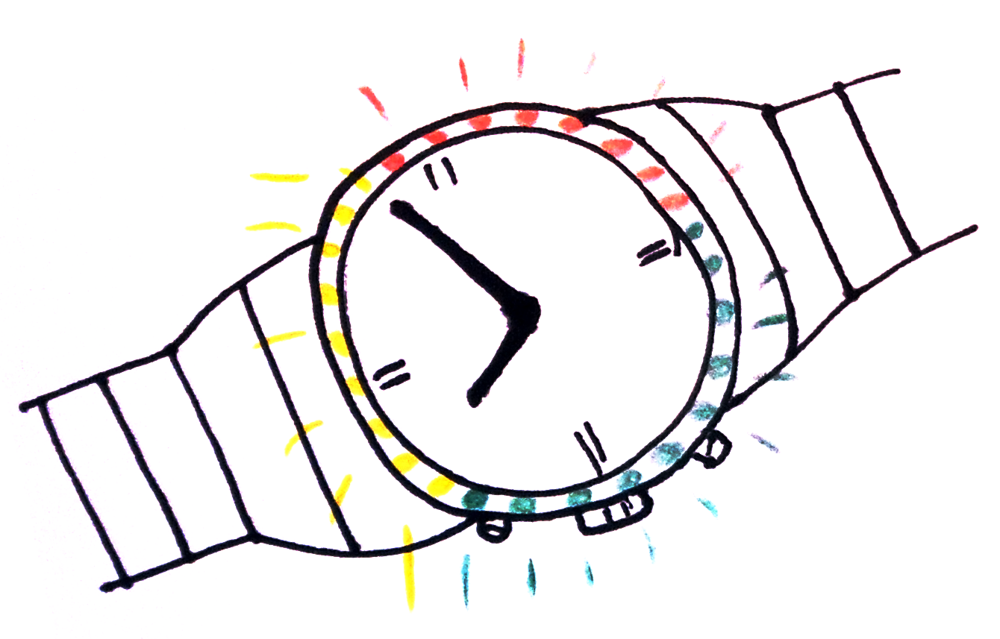
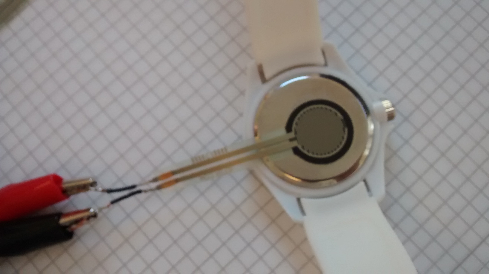
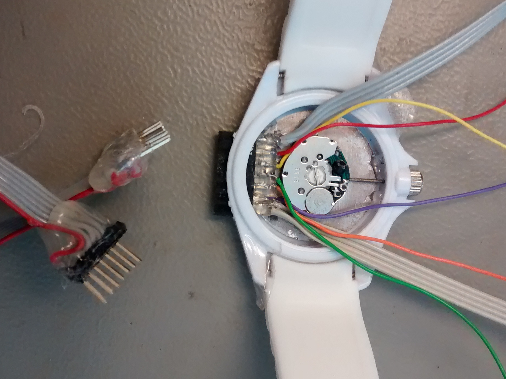
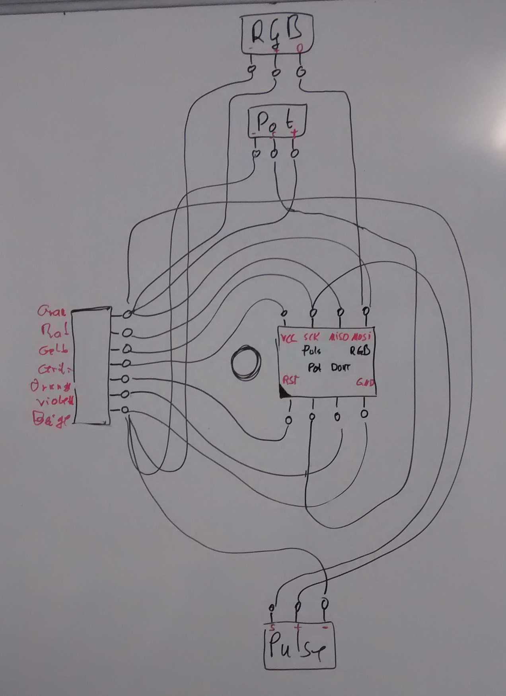
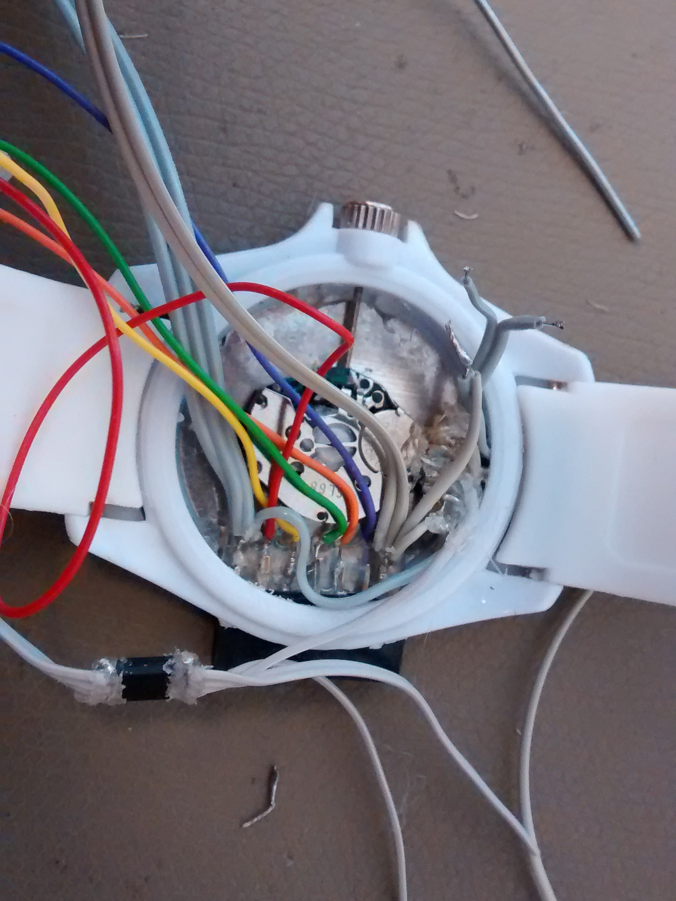

class: center, middle

#### 404 &mdash; Bengt Lüers, Marius Wybrands

# LightWatch

&nbsp;

A wearable light display for body stress.

---

# Agenda

&nbsp;

1. Task
2. Approach
3. Implementation
4. Prototype

---

class: center, middle, inverted, accent-green

# Task

---

# Task

&nbsp;

-   extend a watch to an interactive light display
- 	derive stress level from sensor data
-   correct stress level via user input
-   visualize stress level using RGB LED ring

---

# Interaction Concept

&nbsp;

-   output: system measures pulse, displays guessed stress
-   interaction: user corrects to felt stress using potentiometer

---

class: center, middle, inverted, accent-red

# Approach

---

## Approach

&nbsp;

-   explore feasibility
-   evaluate user input modalities
- 	explore sensor input modalities
-	build prototype

---

## Feasibility Exploration

&nbsp;

-   Task: Watch is very small
-   Problem: Arduino variants won't fit
- 	Solution: Use ATtiny

---

## User Input Modalities

&nbsp;

-   Task: User corrects stress level
-   Problem: No place for inputs on the watch
- 	Solution: Use pressure sensor

---

## Sensor Input Modalites

&nbsp;

---

class: center, middle, inverted, accent-blue

# Implementation

---

## Data Port

&nbsp;

- programmer
- voltage supply

---

## Wiring

&nbsp;

---

class: center, middle, inverted, accent-yellow

# Demo

---

class: center, middle, inverted, accent-black

# The End

---

&nbsp;
