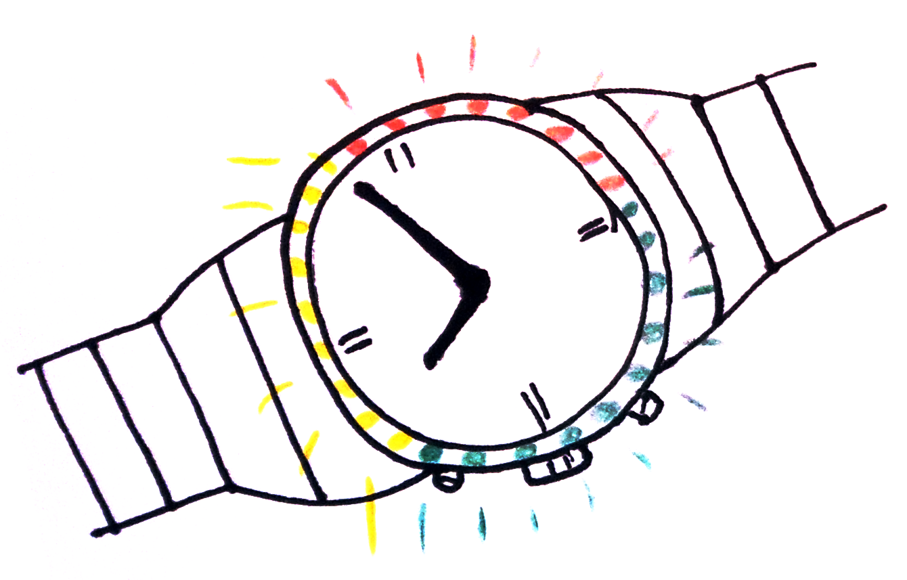

class: center, middle

#### 404 &mdash; Bengt Lüers, Marius Wybrands

# LightWatch

&nbsp;

A wearable light display for body stress.

---

# Agenda

1. Task
2. Approach
3. Implementation
4. Evaluation

---

class: center, middle, inverted, accent-green

# Task

---

# Task

-   extend a watch to an interactive light display
- 	derive stress level from sensor data
-   correct stress level via user input
-   visualize stress level using RGB LED ring

---

class: center, middle, inverted, accent-red

# Approach

---

template:true

# Approach

--

- a

--

- b

---

class: center, middle, inverted, accent-blue

# Implementation

---

&nbsp;

---

class: center, middle, inverted, accent-yellow

# Evaluation

---

&nbsp;

---

class: center, middle, inverted, accent-black

# The End

---

&nbsp;
